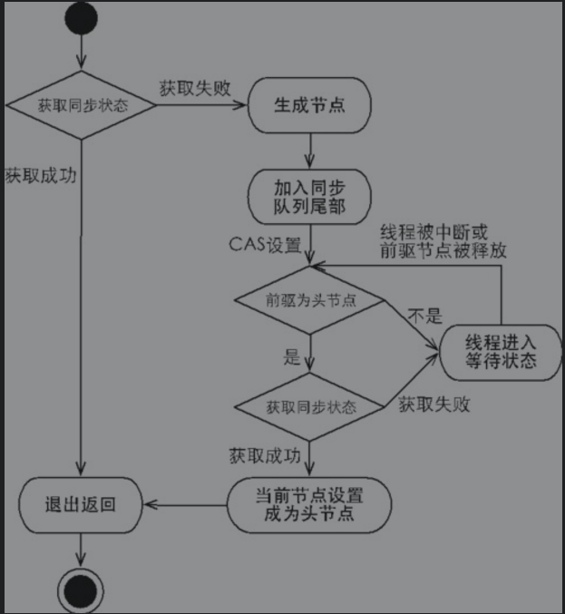
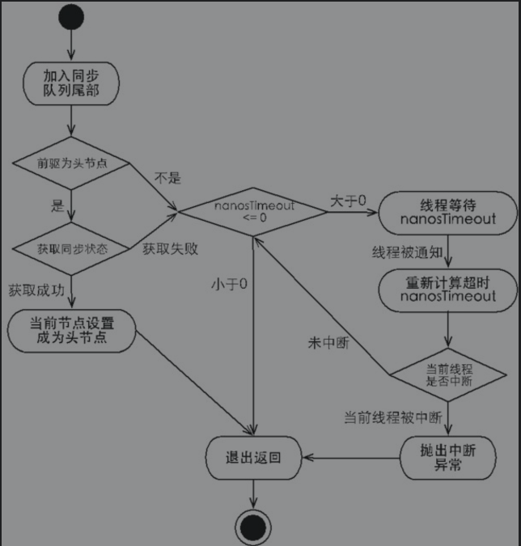

####  Lock接口

##### lock接口的特性：

1. 尝试非阻塞的获取锁：当前线程尝试获取锁，如果这一时刻锁没有被其它线程获取到，则成功获取并持有锁
2. 能被中断的获取锁：获取锁的线程能够响应中断，当获取锁的线程被中断时，中断异常将会被抛出 
3. 超时获取锁：在指定的截止时间之前获取锁，如果截止时间到了仍旧无法获取锁，则返回

##### Lock的API

```java
public interface Lock {
    //获取锁
    void lock();
    
    // 可中断的获取锁，该方法会响应中断，如果当前线程： 在进入此方法时已经设置了该线程的中断状态；或者 在等待获取锁的同时被中断。  则抛出 InterruptedException，并且清除当前线程的已中断状态
    void lockInterruptibly() throws InterruptedException;
    
    // 如果锁被另一个线程保持，则此方法将立即返回 false 值。 
    boolean tryLock();
    
    /**
     *  超时的获取锁,当前线程在以下三种情况下会返回：
     *		当前线程在超时时间内获得了锁
     *		当前线程在超时时间内被中断
     *		超时时间结束返回false
     */
    boolean tryLock(long time, TimeUnit unit) throws InterruptedException;
    
    //释放锁
    void unlock();
    
    //获取等待通知组件，该组件和当前锁绑定，当前线程只有获得了锁，才能调用该组件的wait()方法，调用后当前线程释放锁
    Condition newCondition();
    
}
```


####   队列同步器

队列同步器`AbstractQueuedSynchronized`, 是用来构建锁或其他同步组件的基础框架，使用一个int成员变量表示同步状态，通过内置的FIFO队列来完成资源获取线程的排队工作。

#####  队列同步器接口

```java
public abstract class AbstractQueuedSynchronizer
    extends AbstractOwnableSynchronizer
    implements java.io.Serializable {
	
	//获取当前同步状态
	protected final int getState() {
        return state;
    }
    
    //设置当前同步状态
    protected final void setState(int newState) {
        state = newState;
    }
    
    //使用CAS设置当前状态，该方法保证状态设置的原子性
    protected final boolean compareAndSetState(int expect, int update) {
        // See below for intrinsics setup to support this
        return unsafe.compareAndSwapInt(this, stateOffset, expect, update);
    }
 
	//同步队列的首节点
	private transient volatile Node head;
	//同步队列的尾节点
	private transient volatile Node tail;
}
```

###### 同步器可重写的方法与描述

| 方法名称                            | 描述                                 |
| ----------------------------------- | ------------------------------------ |
| `boolean tryAcquire(int arg)`       | 独占式获取同步状态                   |
| `boolean tryRelease(int arg)`       | 独占式释放同步状态                   |
| `int tryAcquireShared(int arg)`     | 共享式获取同步状态                   |
| `boolean tryReleaseShared(int arg)` | 共享式释放同步状态                   |
| `boolean isHeldExclusively()`       | 当前同步器是否在独占模式下被线程占用 |

###### 同步器的模板方法与描述

| 方法名称                                                     | 描述                                                         |
| ------------------------------------------------------------ | ------------------------------------------------------------ |
| `public final void acquire(int arg)`                         | 独占式获取同步状态，该方法调用重写的`tryAcquire`方法         |
| `public final void acquireInterruptibly(int arg)`            | 与`acquire`方法相同，但该方法响应中断                        |
| `public final boolean tryAcquireNanos(int arg, long nanosTimeout)` | 在 `acquireInterruptibly` 方法的基础上加上了超时限制         |
| `public final void acquireShared(int arg)`                   | 共享式获取同步状态，该方法调用重写的`tryAcquireShared`方法， |
| `public final void acquireSharedInterruptibly(int arg)`      | 与`acquireShared`方法相同，但该方法响应中断                  |
| `public final boolean tryAcquireSharedNanos(int arg, long nanosTimeout)` | 在 `acquireSharedInterruptibly` 方法的基础上加上了超时限制   |
| `public final boolean release(int arg)`                      | 独占式释放同步状态，释放后将队列中第一个节点包含的线程唤醒   |
| `public final boolean releaseShared(int arg)`                | 共享式释放同步状态                                           |
| `public final boolean hasQueuedThreads()`                    | 获取等待在同步队列上的线程集合                               |

同步器提供的模板方法基本上分为3类：独占式获取与释放同步状态、共享式获取与释放同步状态和查询同步队列中的等待线程情况。自定义同步组件将使用同步器提供的模板方法来实现自己的同步语义。


##### 队列同步器的实现分析

###### 1.同步队列

同步器依赖内部的同步队列（一个FIFO双向队列）来完成同步状态的管理，当前线程获取同步状态失败时，同步器会将当前线程以及等待状态等信息构造成为一个节点（Node）并将其加入同步队列，同时会阻塞当前线程，当同步状态释放时，会把首节点中的线程唤醒，使其再次尝试获取同步状态。

同步队列中的节点（Node）用来保存获取同步状态失败的线程引用、等待状态以及前驱和后继节点。

同步队列中的节点的 属性类型与名称以及描述

| 属性类型与名称            | 描述                 |
| ------------------------- | -------------------- |
| `volatile int waitStatus` | 等待状态             |
| `volatile Node prev;`     | 前驱节点             |
| `volatile Node next;`     | 后继节点             |
| `Node nextWaiter;`        | 等待队列中的后继节点 |
| `volatile Thread thread;` | 获取同步状态的线程   |

` waitStatus` 等待状态：包含如下状态：

1. `CANCELLED`：值为1，由于同步队列中等待的 等待超时或被中断，需要从同步队列中取消等待，节点进入该状态将不会变化；
2.  `SIGNAL`：值为-1，后继节点的线程处于等待状态，当前节点的线程如果释放了同步状态或被取消，将会通知后继节点，使后继节点的线程得以运行
3. `CONDITION`：值为-2，节点在等待队列中，节点线程等待在`Condition`上，当其他线程对`Condition` 调用了`signal()`方法后，该节点将会从等待队列中转移到同步队列中，加入到对同步状态的获取
4. `PROPAGATE`：值为-3，表示下一次共享式同步状态获取将会无条件传播下去
5. 0 ：初始状态


同步器拥有首节点（head）和尾节点（tail），没有成功获取同步状态的线程将会成为节点加入该队列的尾部。

当一个线程成功地获取了同步状态（或者锁），其他线程将无法获取到同步状态，转而被构造成为节点并加入到同步队列中，而这个加入队列的过程必须要保证线程安全，因此同步器提供了一个基于`CAS`的设置尾节点的方法：`compareAndSetTail(Nodeexpect, Node update)`，它需要传递当前线程“认为”的尾节点和当前节点，只有设置成功后，当前节点才正式与之前的尾节点建立关联。

同步队列遵循FIFO，首节点是获取同步状态成功的节点，首节点的线程在释放同步状态时，将会唤醒后继节点，而后继节点将会在获取同步状态成功时将自己设置为首节点

设置首节点是通过获取同步状态成功的线程来完成的，由于只有一个线程能够成功获取到同步状态，因此设置头节点的方法并不需要使用CAS来保证，它只需要将首节点设置成为原首节点的后继节点并断开原首节点的next引用即可。

###### 2.独占式同步状态获取与释放

```java
public abstract class AbstractQueuedSynchronizer ... {
    //独占式获取同步状态
    public final void acquire(int arg) {
        if (!tryAcquire(arg) &&
            acquireQueued(addWaiter(Node.EXCLUSIVE), arg)){
            
        	selfInterrupt();
        }
          
    }
    
}
```

上述代码主要完成了同步状态获取、节点构造、加入同步队列以及在同步队列中自旋等待的相关工作，其主要逻辑是：

1. 首先调用自定义同步器实现的`tryAcquire(int arg)`方法，该方法保证线程安全的获取同步状态，
2. 如果同步状态获取失败，则构造同步节点（独占式Node. EXCLUSIVE，同一时刻只能有一个线程成功获取同步状态）并通过`addWaiter(Node node)`方法将该节点加入到同步队列的尾部，
3. 最后调用`acquireQueued(Nodenode, int arg)`方法，使得该节点以“死循环”的方式获取同步状态。如果获取不到则阻塞节点中的线程，而被阻塞线程的唤醒主要依靠前驱节点的出队或阻塞线程被中断来实现。


```java
public abstract class AbstractQueuedSynchronizer ... {
    
    //节点的构造以及加入同步队列
    private Node addWaiter(Node mode) {
        Node node = new Node(Thread.currentThread(), mode);
        //  尝试快速在尾部添加; backup to full enq on failure
        Node pred = tail;
        if (pred != null) {
            node.prev = pred;
            if (compareAndSetTail(pred, node)) {
                pred.next = node;
                return node;
            }
        }
        enq(node);
        return node;
    }
    
    private Node enq(final Node node) {
        for (;;) {
            Node t = tail;
            if (t == null) { // Must initialize
                if (compareAndSetHead(new Node()))
                    tail = head;
            } else {
                node.prev = t;
                if (compareAndSetTail(t, node)) {
                    t.next = node;
                    return t;
                }
            }
        }
    }
}
```

上述代码通过使用`compareAndSetTail(Node expect, Node update)`方法来确保节点能够被线程安全添加。试想一下：如果使用一个普通的`LinkedList`来维护节点之间的关系，那么当一个线程获取了同步状态，而其他多个线程由于调用`tryAcquire(int arg)`方法获取同步状态失败而并发地被添加到`LinkedList`时，`LinkedList`将难以保证Node的正确添加，最终的结果可能是节点的数量有偏差，而且顺序也是混乱的。在`enq(final Node node)`方法中，同步器通过“死循环”来保证节点的正确添加，在“死循环”中只有通过`CAS`将节点设置成为尾节点之后，当前线程才能从该方法返回，否则，当前线程不断地尝试设置。可以看出，`enq(final Node node)`方法将并发添加节点的请求通过`CAS`变得“串行化”了。


节点进入同步队列之后，就进入了一个自旋的过程，每个节点（或者说每个线程）都在自省地观察，当条件满足，获取到了同步状态，就可以从这个自旋过程中退出，否则依旧留在这个自旋过程中（并会阻塞节点的线程）

```java
public abstract class AbstractQueuedSynchronizer ... {
    
    final boolean acquireQueued(final Node node, int arg) {
        boolean failed = true;
        try {
            boolean interrupted = false;
            for (;;) {
                //找到node节点的前驱节点，如果node已经为head，那么会抛出空指针异常
                //空指针异常说明整个等待队列没有能够获取锁的线程
                final Node p = node.predecessor();
                //前驱节点为头结点时，当前线程尝试获取锁
                //如果成功，那么node节点成为新的头结点，这个过程会清空node的线程信息
                if (p == head && tryAcquire(arg)) {
                    setHead(node);
                    p.next = null; // help GC
                    failed = false;
                    return interrupted;
                }
                //当前线程不能获取锁，则说明该节点需要阻塞
                //shouldParkAfterFailedAcquire用于检查和设置节点的阻塞状态
                //未通过检查，则说明没有阻塞，parkAndCheckInterrupt用于阻塞当前线程
                if (shouldParkAfterFailedAcquire(p, node) &&
                    parkAndCheckInterrupt())
                    interrupted = true;
            }
        } finally {
            if (failed)
                cancelAcquire(node);
        }
    }
}
```

在`acquireQueued (final Node node, int arg)`方法中，当前线程在“死循环”中尝试获取同步状态，而只有前驱节点是头节点才能够尝试获取同步状态，这是为什么？原因有两个，如下。

第一，头节点是成功获取到同步状态的节点，而头节点的线程释放了同步状态之后，将会唤醒其后继节点，后继节点的线程被唤醒后需要检查自己的前驱节点是否是头节点。

第二，维护同步队列的FIFO原则。 

由于非首节点线程前驱节点出队或者被中断而从等待状态返回，随后检查自己的前驱是否是头节点，如果是则尝试获取同步状态。可以看到节点和节点之间在循环检查的过程中基本不相互通信，而是简单地判断自己的前驱是否为头节点，这样就使得节点的释放规则符合FIFO，并且也便于对过早通知的处理（过早通知是指前驱节点不是头节点的线程由于中断而被唤醒）。


独占式同步状态获取流程




当前线程获取同步状态并执行了相应逻辑之后，就需要释放同步状态，使得后续节点能够继续获取同步状态。通过调用同步器的`release(int arg)`方法可以释放同步状态，该方法在释放了同步状态之后，会唤醒其后继节点（进而使后继节点重新尝试获取同步状态）。

```java
public abstract class AbstractQueuedSynchronizer ... {
    
    public final boolean release(int arg) {
        if (tryRelease(arg)) {
            Node h = head;
            if (h != null && h.waitStatus != 0)
                unparkSuccessor(h);
            return true;
        }
        return false;
    }
}
```

该方法执行时，会唤醒头节点的后继节点线程，`unparkSuccessor(Nodenode)`方法使用`LockSupport `来唤醒处于等待状态的线程。

总结：在获取同步状态时，同步器维护一个同步队列，获取状态失败的线程都会被加入到队列中并在队列中进行自旋；移出队列（或停止自旋）的条件是前驱节点为头节点且成功获取了同步状态。在释放同步状态时，同步器调用`tryRelease(int arg)`方法释放同步状态，然后唤醒头节点的后继节点。

###### 3.共享式同步状态获取与释放

```java
public abstract class AbstractQueuedSynchronizer ... {
    //共享式获取同步状态
    public final void acquireShared(int arg) {
        if (tryAcquireShared(arg) < 0)
            doAcquireShared(arg);
    }
    
    private void doAcquireShared(int arg) {
        final Node node = addWaiter(Node.SHARED);
        boolean failed = true;
        try {
            boolean interrupted = false;
            for (;;) {
                final Node p = node.predecessor();
                if (p == head) {
                    int r = tryAcquireShared(arg);
                    if (r >= 0) {
                        setHeadAndPropagate(node, r);
                        p.next = null; // help GC
                        if (interrupted)
                            selfInterrupt();
                        failed = false;
                        return;
                    }
                }
                if (shouldParkAfterFailedAcquire(p, node) &&
                    parkAndCheckInterrupt())
                    interrupted = true;
            }
        } finally {
            if (failed)
                cancelAcquire(node);
        }
    }
}
```

在`acquireShared(int arg)`方法中，同步器调用`tryAcquireShared(intarg)`方法尝试获取同步状态，`tryAcquireShared(int arg)`方法返回值为`int`类型，当返回值大于等于0时，表示能够获取到同步状态。因此，在共享式获取的自旋过程中，成功获取到同步状态并退出自旋的条件就是`tryAcquireShared(int arg)`方法返回值大于等于0。可以看到，在`doAcquireShared(int arg)`方法的自旋过程中，如果当前节点的前驱为头节点时，尝试获取同步状态，如果返回值大于等于0，表示该次获取同步状态成功并从自旋过程中退出。

共享式获取也需要释放同步状态，通过调用`releaseShared(int arg)`方法可以释放同步状态

```java
public abstract class AbstractQueuedSynchronizer ... {
    //共享式 释放同步状态
    public final boolean releaseShared(int arg) {
        if (tryReleaseShared(arg)) {
            doReleaseShared();
            return true;
        }
        return false;
    }
}
```

该方法在释放同步状态之后，将会唤醒后续处于等待状态的节点。对于能够支持多个线程同时访问的并发组件（比如Semaphore），它和独占式主要区别在于`tryReleaseShared(int arg)`方法必须确保同步状态（或者资源数）线程安全释放，一般是通过循环和`CAS`来保证的，因为释放同步状态的操作会同时来自多个线程。


######  4.独占式超时获取同步状态

通过调用同步器的`doAcquireNanos(int arg, long nanosTimeout)`方法可以超时获取同步状态，即在指定的时间段内获取同步状态，如果获取到同步状态则返回true，否则，返回false。

超时获取，主要需要计算出需要睡眠的时间间隔`nanosTimeout`，为了防止过早通知，`nanosTimeout`计算公式为：`nanosTimeout -= now - lastTime`，其中`now`为当前唤醒时间，`lastTime`为上次唤醒时间，如果`nanosTimeout`大于0则表示超时时间未到，需要继续睡眠`nanosTimeout`纳秒，反之，表示已经超时.


```java
public abstract class AbstractQueuedSynchronizer ... {
    
     static final long spinForTimeoutThreshold = 1000L;
    
     private boolean doAcquireNanos(int arg, long nanosTimeout)
            throws InterruptedException {
        if (nanosTimeout <= 0L)
            return false;
        final long deadline = System.nanoTime() + nanosTimeout;
        final Node node = addWaiter(Node.EXCLUSIVE);
        boolean failed = true;
        try {
            for (;;) {
                final Node p = node.predecessor();
                //当节点的前驱节点为头节点时尝试获取同步状态，如果获取成功则从该方法返回
                if (p == head && tryAcquire(arg)) {
                    setHead(node);
                    p.next = null; // help GC
                    failed = false;
                    return true;
                }
                nanosTimeout = deadline - System.nanoTime();
                if (nanosTimeout <= 0L) //小于等于0表示已经超时
                    return false;
                if (shouldParkAfterFailedAcquire(p, node) &&
                    nanosTimeout > spinForTimeoutThreshold)
                    LockSupport.parkNanos(this, nanosTimeout); ////进行等待
                if (Thread.interrupted())
                    throw new InterruptedException();
            }
        } finally {
            if (failed)
                cancelAcquire(node);
        }
    }
    
    
    private static boolean shouldParkAfterFailedAcquire(Node pred, Node node) {
        int ws = pred.waitStatus;
        if (ws == Node.SIGNAL)  // -1
            //该节点已经设置了状态，要求释放以发出信号，以便可以安全地停放。
            return true;
        if (ws > 0) {
            /*
             *  前任已取消。 跳过前任并指示重试。
             */
            do {
                node.prev = pred = pred.prev;
            } while (pred.waitStatus > 0);
            pred.next = node;
        } else {
            /*
             * waitStatus必须为0或传播。表明我们需要信号，但不要停车。
             * 来电者需要请重试以确保在停车前无法获取
             */
            compareAndSetWaitStatus(pred, ws, Node.SIGNAL);
        }
        return false;
    }
}
```

如果当前线程获取同步状态失败，则判断是否超时（nanosTimeout小于等于0表示已经超时），如果没有超时，重新计算超时间隔nanosTimeout，然后使当前线程等待nanosTimeout纳秒（当已到设置的超时时间，该线程会从`LockSupport.parkNanos(Object blocker, long nanos)`方法返回）。

如果`nanosTimeout`小于等于`spinForTimeoutThreshold`（1000纳秒）时，将不会使该线程进行超时等待，而是进入快速的自旋过程。原因在于，非常短的超时等待无法做到十分精确，如果这时再进行超时等待，相反会让nanosTimeout的超时从整体上表现得反而不精确。因此，在超时非常短的场景下，同步器会进入无条件的快速自旋。




###### 5.自定义同步组件—TwinsLock

设计一个同步工具：该工具在同一时刻，只允许至多两个线程同时访问，超过两个线程的访问将被阻塞，我们将这个同步工具命名为TwinsLock。

首先，确定访问模式。TwinsLock能够在同一时刻支持多个线程的访问，这显然是共享式访问，因此，需要使用同步器提供的acquireShared(intargs)方法等和Shared相关的方法，这就要求TwinsLock必须重写tryAcquireShared(int args)方法和tryReleaseShared(int args)方法，这样才能保证同步器的共享式同步状态的获取与释放方法得以执行。

其次，定义资源数。TwinsLock在同一时刻允许至多两个线程的同时访问，表明同步资源数为2，这样可以设置初始状态status为2，当一个线程进行获取，status减1，该线程释放，则status加1，状态的合法范围为0、1和2，其中0表示当前已经有两个线程获取了同步资源，此时再有其他线程对同步状态进行获取，该线程只能被阻塞。在同步状态变更时，需要使用compareAndSet(int expect, int update)方法做原子性保障。

最后，组合自定义同步器。

```java
public class TwinsLock implements Lock {
    private final Sync sync = new Sync(2);
    @Override
    public void lock() {
        sync.acquireShared(1);
    }

    @Override
    public void unlock() {
        sync.releaseShared(1);
    }

    private static final class Sync extends AbstractQueuedSynchronizer {

        Sync(int count){
            if (count <= 0){
                throw new IllegalArgumentException(" count 必须 大于0 ");
            }
            setState(count);
        }

        @Override
        public int tryAcquireShared(int reduceCount) {
            for (;;){
                int current = getState();
                int newCount = current - reduceCount;
                if (newCount < 0  || compareAndSetState(current , newCount)){
                    return newCount;
                }
            }
        }

        @Override
        public boolean tryReleaseShared(int returnCount) {
            for (;;){
                int current = getState();
                int newCount = current + returnCount;
                if (compareAndSetState(current,newCount)){
                    return true;
                }
            }
        }
    }

    ...
}
```

在上述示例中，TwinsLock实现了Lock接口，提供了面向使用者的接口，使用者调用lock()方法获取锁，随后调用unlock()方法释放锁，而同一时刻只能有两个线程同时获取到锁。TwinsLock同时包含了一个自定义同步器Sync，而该同步器面向线程访问和同步状态控制。以共享式获取同步状态为例：同步器会先计算出获取后的同步状态，然后通过CAS确保状态的正确设置，当tryAcquireShared(int reduceCount)方法返回值大于等于0时，当前线程才获取同步状态，对于上层的TwinsLock而言，则表示当前线程获得了锁。