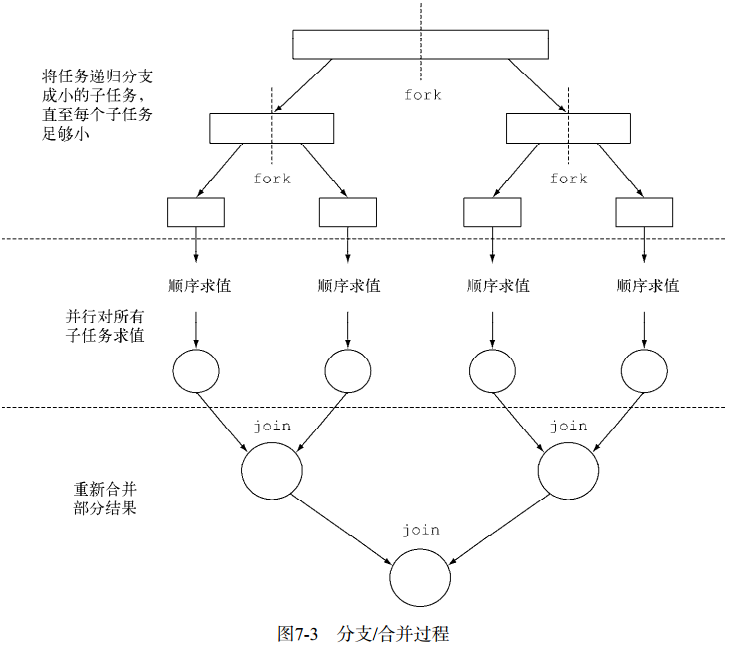

#####  将顺序流转换为并行流  parallel()     

```java
Stream.iterate(1L, i -> i + 1)
	.limit(n)
	.parallel()
	.reduce(0L, Long::sum);
```


#####  高效使用并行流 

自动装箱和拆箱操作会大大降低性能。 Java 8中有原始类型流（IntStream、 LongStream、 DoubleStream）来避免这种操作，但凡有可能都应该用这些流。    

有些操作本身在并行流上的性能就比顺序流差。特别是limit和findFirst等依赖于元 素顺序的操作，它们在并行流上执行的代价非常大。    

对于较小的数据量，选择并行流几乎从来都不是一个好的决定。    

要考虑流背后的数据结构是否易于分解。例如， ArrayList的拆分效率比LinkedList 高得多，因为前者用不着遍历就可以平均拆分，而后者则必须遍历。    

还要考虑终端操作中合并步骤的代价是大是小（例如Collector中的combiner方法）。 如果这一步代价很大，那么组合每个子流产生的部分结果所付出的代价就可能会超出通 过并行流得到的性能提升    

流自身的特点，以及流水线中的中间操作修改流的方式，都可能会改变分解过程的性能。 例如，一个SIZED流可以分成大小相等的两部分，这样每个部分都可以比较高效地并行处 理，但筛选操作可能丢弃的元素个数却无法预测，导致流本身的大小未知。    

```java
//快
LongStream.rangeClosed(1, n)
		.parallel()
		.reduce(0L, Long::sum);
//LongStream.rangeClosed直接产生原始类型的long数字，没有装箱拆箱的开销。
// LongStream.rangeClosed会生成数字范围，很容易拆分为独立的小块。


```

####  ForkJoinPool线程池 

要把任务提交到这个池，必须创建RecursiveTask<R>的一个子类，其中R是并行化任务（以 及所有子任务）产生的结果类型，或者如果任务不返回结果，则是RecursiveAction类型（当 然它可能会更新其他非局部机构）。要定义RecursiveTask， 只需实现它唯一的抽象方法 compute： protected abstract R compute();    




```java
public class ForkJoinSumCalculator
	extends java.util.concurrent.RecursiveTask<Long> {
	//要求和的数组
	private final long[] numbers;
	//子任务处理的数组的起始和终止位置
	private final int start;
	private final int end;
	//不再将任务分解为子任务的数组大小
	public static final long THRESHOLD = 10_000;
	//公共构造函数用于创建主任务
	public ForkJoinSumCalculator(long[] numbers) {
		this(numbers, 0, numbers.length);
	}
	//私有构造函数用于以递归方式为主任务创建子任务
	private ForkJoinSumCalculator(long[] numbers, int start, int end) {
		this.numbers = numbers;
		this.start = start;
		this.end = end;
	}
	//覆盖RecursiveTask抽象方法
	@Override
	protected Long compute() {
		int length = end - start;
		if (length <= THRESHOLD) {
			return computeSequentially();
		}
		//创建一个子任务来为数组的前一半求和
		ForkJoinSumCalculator leftTask =
			new ForkJoinSumCalculator(numbers, start, start + length/2);
		//利用另一个ForkJoinPool线程异步执行新创建的子任务
		leftTask.fork();
		//创建一个任务为数组的后一半求和
		ForkJoinSumCalculator rightTask =
			new ForkJoinSumCalculator(numbers, start + length/2, end);
		//同步执行第二个子任务，有可能允许进一步递归划分
		Long rightResult = rightTask.compute();
		//读取第一个子任务的结果，如果尚未完成就等待
		Long leftResult = leftTask.join();
		//该任务的结果是两个子任务结果的组合
		return leftResult + rightResult;
	}
	//在子任务不再可分时计 算 结果 的 简单算法
	private long computeSequentially() {
		long sum = 0;
		for (int i = start; i < end; i++) {{
			sum += numbers[i];
		}
		return sum;
	}
}
```

  

```java
public static long forkJoinSum(long n) {
	long[] numbers = LongStream.rangeClosed(1, n).toArray();
	ForkJoinTask<Long> task = new ForkJoinSumCalculator(numbers);
	return new ForkJoinPool().invoke(task);
}
```

#####  fork

**对子任务调用fork方法**可以把它排进ForkJoinPool。**同时对左边和右边的子任务调用它的效率要比直接对其中一个调用compute低**。这样做你可以为 其中一个子任务重用同一线程，从而避免在线程池中多分配一个任务造成的开销。  

不应该在RecursiveTask内部使用ForkJoinPool的invoke方法。相反，你应该始终直 接调用compute或fork方法，只有顺序代码才应该用invoke来启动并行计算。    


##### Spliterator 

Spliterator是Java 8中加入的另一个新接口；这个名字代表“可分迭代器”（splitable iterator）。和Iterator一样， Spliterator也用于遍历数据源中的元素，但它是为了并行执行 而设计的。    